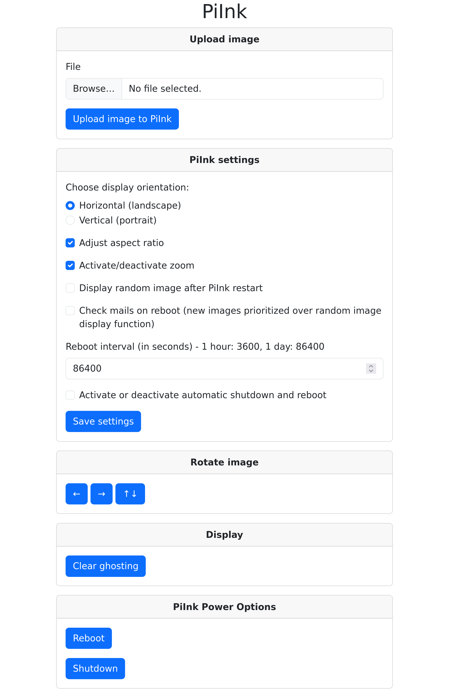

# PiInk Advanced - A Raspberry Pi Powered E-Ink Picture Frame
The project's idea is mainly derived from https://github.com/tlstommy/PiInk . Modifications include:
- Complete code rewrite (Web UI)
- Check mail feature (receive image attachments via email)
- Support of battery management pHat (https://github.com/bablokb/pcb-pi-batman)

The hardware setup is:
- Raspberry Pi (Zero 2 W)
- E-Ink Display (Pimoroni Inky Impression E-Ink Display)
- (optional) Battery Management PCB (https://github.com/bablokb/pcb-pi-batman)

# Installation

## Requirements
- Tested on Raspbian light
- Setup with username 'user'
- The git repository is expected to be checked out in the users home directory '~/'

## Install python3 dependencies
```
python3 -m venv ~/env
source ~/env/bin/activate
pip3 install -r ~/PiInk/scripts/requirements.txt
sudo apt update && sudo apt upgrade
sudo apt install python3-dev jq
```

## Change settings
Search for "CHANGEME" in all files and change the settings (`e.g. grep -R "CHANGEME" *`)

## Execute install script
```
chmod +x ~/PiInk/scripts/setup.sh
~/PiInk/scripts/setup.sh
```

# Usage

## Command line
- curl -X POST -F file=@image.png 127.0.0.1 (Image image.png is displayed)
- curl http://localhost/random (Random image is displayed)

## Web UI
URI: http://piink.local

